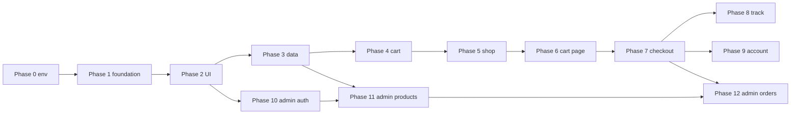
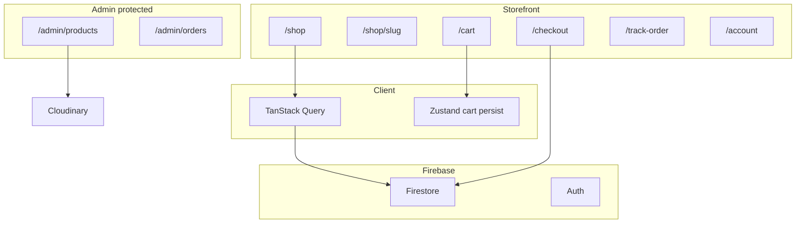
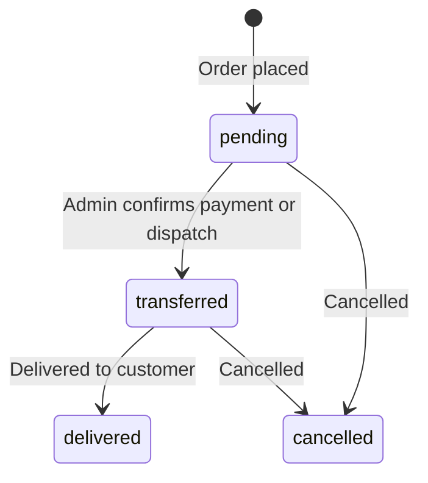

# Store E-Commerce — Step-by-Step Build Guide

Build a professional cash-on-delivery (COD) e-commerce store on this Next.js 16 repo. Work **one phase at a time**: open Cursor Agent, paste **only that phase’s Cursor prompt**, verify acceptance criteria, then move on.

**Stack:** Next.js 16 App Router · React 19 · Tailwind 4 · Firebase (Firestore + Auth) · Cloudinary · TanStack Query · Zustand · Zod · React Hook Form

**Decisions (locked):**
- Payment: **COD only**
- Customers: **guest checkout** + **optional accounts** for order history
- Admin: **Firebase Auth** with allowlisted admin email(s)
- UI: **light theme**, 3–4 colors, reusable components (no dark mode)

---

## Table of contents

| Step | Phase | Section |
|------|-------|---------|
| 0 | Prerequisites (you) | [Phase 0](#phase-0--prerequisites-manual) |
| 1 | Project foundation | [Phase 1](#phase-1--project-foundation) |
| 2 | Design system + layout | [Phase 2](#phase-2--design-system-and-layout-shell) |
| 3 | Firebase data layer | [Phase 3](#phase-3--firebase-data-layer-types--tanstack-query) |
| 4 | Zustand cart | [Phase 4](#phase-4--zustand-cart-store) |
| 5 | Shop storefront | [Phase 5](#phase-5--shop-storefront) |
| 6 | Cart page | [Phase 6](#phase-6--cart-page) |
| 7 | Checkout (COD) | [Phase 7](#phase-7--checkout-cod-and-order-confirmation) |
| 8 | Order tracking | [Phase 8](#phase-8--order-tracking) |
| 9 | Customer auth | [Phase 9](#phase-9--optional-customer-auth-and-order-history) |
| 10 | Admin auth + layout | [Phase 10](#phase-10--admin-auth-and-layout) |
| 11 | Admin products | [Phase 11](#phase-11--admin-products-crud--cloudinary) |
| 12 | Admin orders + polish | [Phase 12](#phase-12--admin-orders-polish-and-documentation) |

Reference (read anytime): [Design system](#design-system-use-everywhere) · [Firestore schema](#firestore-data-model) · [Routes](#route-map) · [Appendices](#appendix-a--future-enhancements-out-of-scope)

---

## Build steps — do NOT do everything at once

Use this repo in **13 small steps** (Step 1 = Phase 0 manual setup, Steps 2–13 = Phases 1–12 in Cursor). Each step is one Cursor session (or one focused Agent run). Finish and test before the next step.

### Rules

1. **One phase per Agent chat** (recommended) or one phase per prompt — never paste all phases together.
2. **Phase 0 is manual** — no Cursor prompt; set up Firebase, Cloudinary, and `.env.local` first.
3. **Never skip ahead** — later phases depend on earlier ones (see dependency list below).
4. **Check acceptance criteria** in each phase section before moving on.
5. Use **Agent mode** in Cursor to implement; use **Ask mode** only for questions.

### Master progress checklist

Copy this into your notes and tick as you go:

```
[ ] Step 1/13  — Phase 0: Firebase, Cloudinary, .env.local, admin user (manual)
[ ] Step 2/13  — Phase 1: Dependencies, env validation, Firebase client, QueryProvider
[ ] Step 3/13  — Phase 2: Design tokens, UI components, header/footer
[ ] Step 4/13  — Phase 3: Types, Firestore queries, TanStack hooks
[ ] Step 5/13  — Phase 4: Zustand cart + header badge
[ ] Step 6/13  — Phase 5: /shop, product detail, add to cart
[ ] Step 7/13  — Phase 6: /cart page
[ ] Step 8/13  — Phase 7: /checkout, create order, confirmation page
[ ] Step 9/13  — Phase 8: /track-order
[ ] Step 10/13 — Phase 9: /account, optional customer auth
[ ] Step 11/13 — Phase 10: /admin login + protected layout
[ ] Step 12/13 — Phase 11: Admin product CRUD + Cloudinary upload
[ ] Step 13/13 — Phase 12: Admin orders, polish, README
```

### What you do every time (Phases 1–12)

| # | Action |
|---|--------|
| 1 | Open Cursor → switch to **Agent** mode |
| 2 | Ensure `.env.local` is filled (from [`.env.example`](../.env.example)) |
| 3 | Scroll to the phase section below (e.g. **Phase 3**) |
| 4 | Copy the entire **Cursor prompt** code block for that phase |
| 5 | Paste into chat + add the [standard wrapper](#standard-prompt-wrapper-copy-every-time) below the prompt |
| 6 | Let Agent finish; run `pnpm dev` if needed |
| 7 | Complete **Manual test** and tick **Acceptance criteria** for that phase |
| 8 | Commit your work (optional but recommended) — e.g. `git commit -m "feat: phase 3 firebase data layer"` |
| 9 | Start a **new** Agent chat for the next phase (keeps context clean) |

### Standard prompt wrapper (copy every time)

Paste this **after** the phase-specific Cursor prompt:

```
Implement ONLY the phase described above for the store-ecom repo.
Do NOT start the next phase or build unrelated features.
Follow acceptance criteria and file paths in docs/ECOM_BUILD_GUIDE.md.
Read AGENTS.md and node_modules/next/dist/docs/ for Next.js 16 APIs.
Use pnpm. Light theme only — use design tokens from the guide.
When done, list what was created/changed and which acceptance criteria are satisfied.
```

### Example: starting Step 1 (Phase 1)

1. Finish Phase 0 checklist.
2. Open Agent and paste the **Phase 1** prompt from [below](#phase-1--project-foundation).
3. Add the standard wrapper.
4. Send. When done, run `pnpm dev` — app should start without env errors.
5. Only then open a new chat for Phase 2.

### Phase dependencies (do not skip)



| If you skip… | What breaks |
|--------------|-------------|
| Phase 0 | Missing Firebase/Cloudinary credentials |
| Phase 1–2 | No providers, no UI components for later pages |
| Phase 3 | Shop/checkout have no data layer |
| Phase 4–6 | No cart before checkout |
| Phase 7 | No orders to track or show in admin |
| Phase 10 | Admin routes unprotected |
| Phase 11 | Admin has nothing to sell |

### What NOT to do

- Do not paste Phases 1–12 in one message.
- Do not say “build the full e-commerce store” without naming a single phase.
- Do not start Phase 5 (shop) before Phase 3 (Firestore types/queries).
- Do not start Phase 10 (admin) before Phase 7 (checkout creates orders).
- Do not commit `.env.local` to git.

### If something goes wrong

Stay on the **same phase**. Start a new Agent message:

```
Continue Phase N only. Fix: [describe bug or error].
Do not implement Phase N+1. Reference docs/ECOM_BUILD_GUIDE.md Phase N acceptance criteria.
```

### Estimated order of work

| Phase | Who | Time hint |
|-------|-----|-----------|
| 0 | You (manual) | 30–60 min |
| 1–4 | Cursor Agent | Foundation + cart |
| 5–8 | Cursor Agent | Customer-facing store |
| 9 | Cursor Agent | Optional accounts |
| 10–12 | Cursor Agent | Admin panel + polish |

---

## How to use this guide (quick reference)

1. Complete **Phase 0** manually (Firebase, Cloudinary, env vars).
2. For phases **1–12**, follow [Build steps](#build-steps--do-not-do-everything-at-once) above.
3. Copy **only that phase’s Cursor prompt** + [standard wrapper](#standard-prompt-wrapper-copy-every-time).
4. Run manual tests and tick acceptance criteria before the next phase.
5. Read `AGENTS.md` and `node_modules/next/dist/docs/` when the agent touches Next.js APIs (Next.js 16).

---

## Architecture overview



---

## Design system (use everywhere)

Define in `src/app/globals.css` and use only these tokens (no extra accent colors):

| Token | Value | Usage |
|-------|-------|--------|
| `--background` | `#FAFAF8` | Page background |
| `--foreground` | `#1A1A1A` | Headings, primary text |
| `--accent` | `#2D6A4F` | Primary buttons, links, focus ring |
| `--muted` | `#6B7280` | Secondary text, borders |
| `--surface` | `#FFFFFF` | Cards, inputs |
| `--danger` | `#B91C1C` | Errors only (optional 5th, use sparingly) |

**Typography:** Geist (already in layout). Use consistent scale: `text-sm`, `text-base`, `text-lg`, `text-2xl`, `text-3xl`.

**Reusable UI** (`src/components/ui/`): `Text`, `Button`, `Input`, `Label`, `Textarea`, `Badge`, `Card`, `Container`, `Price`, `Spinner`, `EmptyState`.

**Product badges:** `Sale` (accent outline), `Sold out` (muted), hidden products never appear in shop queries.

---

## Target folder structure

```
src/
  app/
    layout.tsx
    page.tsx
    shop/page.tsx
    shop/[slug]/page.tsx
    cart/page.tsx
    checkout/page.tsx
    order/[orderNumber]/page.tsx
    track-order/page.tsx
    account/page.tsx
    account/orders/page.tsx
    admin/layout.tsx
    admin/login/page.tsx
    admin/page.tsx
    admin/products/page.tsx
    admin/products/new/page.tsx
    admin/products/[id]/edit/page.tsx
    admin/orders/page.tsx
    admin/orders/[id]/page.tsx
    api/upload/route.ts
  components/
    ui/
    layout/
    shop/
    cart/
    checkout/
    orders/
    admin/
  lib/
    firebase/client.ts
    firebase/admin.ts          # optional server helpers
    firebase/collections.ts
    cloudinary/upload.ts
    queries/products.ts
    queries/orders.ts
    utils/format.ts
    utils/order-number.ts
    env.ts
  providers/
    query-provider.tsx
    auth-provider.tsx
  stores/
    cart-store.ts
  types/
    product.ts
    order.ts
    cart.ts
    user.ts
  hooks/
    use-products.ts
    use-orders.ts
docs/
  ECOM_BUILD_GUIDE.md
.env.example
```

---

## Environment variables

Copy [`.env.example`](../.env.example) to `.env.local` and fill values (never commit `.env.local`).

---

## Firestore data model

### Collection: `products` (document ID = auto or slug-based)

| Field | Type | Notes |
|-------|------|--------|
| `name` | string | Display name |
| `slug` | string | URL-safe, unique |
| `type` | string | Category label (e.g. Clothing, Accessories) |
| `description` | string | Long text |
| `images` | string[] | Cloudinary HTTPS URLs |
| `price` | number | Regular price (cents or whole units — pick one, stay consistent) |
| `salePrice` | number? | Required when `onSale` is true |
| `onSale` | boolean | Show sale UI |
| `quantity` | number | Stock; `0` → Sold out on storefront |
| `hidden` | boolean | If true, exclude from public shop |
| `createdAt` | timestamp | server |
| `updatedAt` | timestamp | server |

**Storefront rules:**
- Query: `hidden == false`
- UI: `quantity === 0` → show **Sold out** (still visible unless you choose to hide; default: visible with badge, add-to-cart disabled)
- Price display: if `onSale && salePrice`, show sale price + strikethrough regular price

### Collection: `orders`

| Field | Type | Notes |
|-------|------|--------|
| `orderNumber` | string | Public ID, e.g. `ORD-20260518-A7K2` |
| `status` | string | `pending` \| `transferred` \| `delivered` \| `cancelled` |
| `paymentMethod` | string | Always `"cod"` |
| `items` | array | Snapshot: `{ productId, name, slug, image, unitPrice, quantity }` |
| `customer` | object | `{ name, phone, email, addressLine1, city, postalCode?, notes? }` |
| `userId` | string? | Set when logged-in customer places order |
| `subtotal` | number | |
| `shipping` | number | Can be `0` for v1 |
| `total` | number | |
| `createdAt` | timestamp | |
| `updatedAt` | timestamp | |

**Order number generator:** `ORD-YYYYMMDD-XXXX` where `XXXX` is 4 alphanumeric chars (use `nanoid` custom alphabet).

### Collection: `users` (optional customer profiles)

| Field | Type | Notes |
|-------|------|--------|
| `uid` | string | Firebase Auth UID (document ID) |
| `email` | string | |
| `displayName` | string? | |
| `phone` | string? | |
| `createdAt` | timestamp | |

### Admin allowlist

Store in env: `NEXT_PUBLIC_ADMIN_EMAILS=admin@example.com,other@example.com`  
Client checks email after login; server/middleware should also guard `/admin/*` routes.

---

## Firestore security rules (outline)

Deploy in Firebase Console → Firestore → Rules. Adjust after testing.

```javascript
rules_version = '2';
service cloud.firestore {
  match /databases/{database}/documents {
    function isAdmin() {
      return request.auth != null
        && request.auth.token.email in [
          // Prefer custom claims in production; for v1, maintain list in rules or use Cloud Function
          "admin@example.com"
        ];
    }

    function isOwner(userId) {
      return request.auth != null && request.auth.uid == userId;
    }

    match /products/{id} {
      allow read: if resource.data.hidden == false || isAdmin();
      allow write: if isAdmin();
    }

    match /orders/{id} {
      allow create: if request.resource.data.paymentMethod == 'cod'
        && request.resource.data.keys().hasAll(['orderNumber', 'status', 'items', 'customer', 'total']);
      allow read: if isAdmin()
        || (isOwner(resource.data.userId))
        // Guest track uses server/API or composite query — see Phase 8
        ;
      allow update: if isAdmin();
    }

    match /users/{userId} {
      allow read, write: if isOwner(userId);
    }
  }
}
```

> **Note:** Guest order lookup by `orderNumber` + `phone` is easier via a **Next.js API route** or **Callable Cloud Function** that validates the pair server-side instead of exposing all orders in client rules.

---

## Route map

| Route | Description |
|-------|-------------|
| `/` | Home, featured products |
| `/shop` | Product grid, filter by `type` |
| `/shop/[slug]` | Product detail, add to cart |
| `/cart` | Cart (Zustand) |
| `/checkout` | COD form, place order |
| `/order/[orderNumber]` | Confirmation |
| `/track-order` | Lookup status |
| `/account` | Sign in / register (optional) |
| `/account/orders` | Logged-in order history |
| `/admin/login` | Admin Firebase login |
| `/admin` | Dashboard redirect |
| `/admin/products` | Product list |
| `/admin/products/new` | Create product |
| `/admin/products/[id]/edit` | Edit product |
| `/admin/orders` | All orders |
| `/admin/orders/[id]` | Order detail, change status |

---

## Order status flow (admin)



Customer-facing labels: **Pending** → **Transferred** → **Delivered** (or **Cancelled**).

---

# Phase 0 — Prerequisites (manual)

**Step 1 of 13** · Phase 0 · No Cursor prompt · You do this manually

### Goal

Create Firebase and Cloudinary projects and local env file so later phases can connect.

### Steps for this phase

1. Create a Firebase project and enable Firestore + Authentication (Email/Password).
2. Register a web app in Firebase and copy config values into `.env.local`.
3. Create a Cloudinary account and copy cloud name, API key, and API secret into `.env.local`.
4. Copy [`.env.example`](../.env.example) → `.env.local` and fill every variable.
5. Set `NEXT_PUBLIC_ADMIN_EMAILS` to your admin email.
6. In Firebase Auth, create a user with that admin email.
7. Run `pnpm install` in the project root.
8. Tick the checklist below, then start **Phase 1** in a new Agent chat.

### Checklist

- [ ] Firebase project created (Firestore + Authentication enabled)
- [ ] Email/Password sign-in enabled in Firebase Auth
- [ ] Firestore database created (production mode; add rules from this doc later)
- [ ] Cloudinary account; note cloud name, API key, API secret
- [ ] `.env.local` created from `.env.example`
- [ ] At least one admin user registered in Firebase Auth with allowlisted email
- [ ] `pnpm install` runs successfully in repo root

### Manual steps

1. [Firebase Console](https://console.firebase.google.com/) → Create project → Add web app → copy config into `.env.local`.
2. Authentication → Sign-in method → Email/Password → Enable.
3. Firestore → Create database.
4. [Cloudinary](https://cloudinary.com/) → Dashboard → copy credentials.
5. Copy `.env.example` → `.env.local` and fill all values.
6. Create admin user: Authentication → Add user (email matching `NEXT_PUBLIC_ADMIN_EMAILS`).

**No Cursor prompt for Phase 0.**

---

# Phase 1 — Project foundation

**Step 2 of 13** · Phase 1 · Cursor Agent required

### Goal

Install dependencies, validate env, initialize Firebase client, TanStack Query provider, and base folder structure.

### Steps for this phase

1. Confirm **Phase 0** checklist is complete and `.env.local` exists.
2. Open Cursor **Agent** mode (new chat).
3. Copy the **Cursor prompt** below + [standard wrapper](#standard-prompt-wrapper-copy-every-time).
4. After Agent finishes, run `pnpm dev` and confirm no env errors.
5. Tick **Acceptance criteria** below.
6. Continue to **Phase 2** only.

### Files to create/edit

- `package.json` (dependencies)
- `src/lib/env.ts`
- `src/lib/firebase/client.ts`
- `src/lib/firebase/collections.ts`
- `src/providers/query-provider.tsx`
- `src/app/layout.tsx` (wrap with providers)
- `.env.example` (already in repo; verify completeness)

### Acceptance criteria

- [ ] Packages installed: `firebase`, `@tanstack/react-query`, `zustand`, `zod`, `react-hook-form`, `@hookform/resolvers`, `nanoid`, `lucide-react`, `cloudinary`
- [ ] `src/lib/env.ts` validates required public env vars with Zod; throws clear error in dev if missing
- [ ] Firebase app + Firestore instance exported from `client.ts` (client-only; guard `typeof window`)
- [ ] `QueryProvider` wraps children in root layout with sensible `staleTime` defaults
- [ ] No storefront or admin pages built yet

### Manual test

- `pnpm dev` starts without env-related crashes when `.env.local` is filled
- React Query Devtools optional (only in dev if you add it)

### Cursor prompt

```
Implement Phase 1 (Project foundation) for store-ecom only. Do not implement design system, shop, cart, admin, or any pages beyond wiring providers.

Requirements:
- Install: firebase, @tanstack/react-query, zustand, zod, react-hook-form, @hookform/resolvers, nanoid, lucide-react, cloudinary
- Create src/lib/env.ts using Zod to validate NEXT_PUBLIC_FIREBASE_* vars and NEXT_PUBLIC_ADMIN_EMAILS (comma-separated emails). Export typed env object.
- Create src/lib/firebase/client.ts: initialize Firebase app and export auth + firestore for browser only.
- Create src/lib/firebase/collections.ts with constants: products, orders, users.
- Create src/providers/query-provider.tsx with QueryClientProvider (staleTime 60s, refetchOnWindowFocus false for storefront).
- Update src/app/layout.tsx to wrap children with QueryProvider.
- Use pnpm. Read node_modules/next/dist/docs/ before changing Next.js APIs (Next 16).
- Match existing TypeScript and App Router conventions. No dark mode.

Do not build UI components, routes, cart, or admin in this phase.
```

---

# Phase 2 — Design system and layout shell

**Step 3 of 13** · Phase 2 · Cursor Agent required

### Goal

Light-theme tokens, reusable UI primitives, site header/footer, and storefront layout.

### Steps for this phase

1. Confirm **Phase 1** acceptance criteria are done.
2. New Agent chat → paste **Phase 2** prompt + [standard wrapper](#standard-prompt-wrapper-copy-every-time).
3. Visit `/` in the browser — check header, footer, and colors match the guide.
4. Tick **Acceptance criteria** below.
5. Continue to **Phase 3** only.

### Files to create/edit

- `src/app/globals.css` (CSS variables)
- `src/components/ui/*` (Button, Text, Input, Label, Textarea, Badge, Card, Container, Price, Spinner, EmptyState)
- `src/components/layout/header.tsx`, `footer.tsx`, `store-layout.tsx`
- `src/app/layout.tsx` (header/footer on storefront; admin routes excluded later)

### Acceptance criteria

- [ ] Only design tokens listed in this guide (background, foreground, accent, muted, surface)
- [ ] `Button` variants: primary (accent), secondary (outline), ghost; sizes sm/md/lg
- [ ] `Text` variants: h1, h2, body, muted, small
- [ ] `Price` formats currency consistently (e.g. USD `$12.00`)
- [ ] Header: logo/name, nav links (Shop, Cart, Track Order, Account), cart item count placeholder (0 for now)
- [ ] Footer: minimal copyright + links
- [ ] Remove default create-next-app marketing content from home page; simple hero placeholder

### Manual test

- Visit `/` — consistent spacing, colors, responsive header

### Cursor prompt

```
Implement Phase 2 (Design system and layout) for store-ecom. Do not add Firebase data fetching, cart logic, or admin.

Requirements:
- Update src/app/globals.css with CSS variables: --background #FAFAF8, --foreground #1A1A1A, --accent #2D6A4F, --muted #6B7280, --surface #FFFFFF. Map to Tailwind @theme if using Tailwind v4.
- Create reusable components in src/components/ui/: Text, Button, Input, Label, Textarea, Badge, Card, Container, Price, Spinner, EmptyState. Use cn() helper in src/lib/utils/cn.ts (clsx + tailwind-merge if needed).
- Create src/components/layout/header.tsx, footer.tsx, store-layout.tsx with nav: Shop (/shop), Cart (/cart), Track Order (/track-order), Account (/account).
- Update src/app/layout.tsx to use StoreLayout for public pages. Simple src/app/page.tsx hero ("Welcome to [Store Name]") and CTA link to /shop.
- Light theme only. No shadcn CLI unless necessary; prefer thin custom components.
- Read node_modules/next/dist/docs/ for Next 16 patterns.

Do not implement shop product grid, Zustand, or Firebase queries yet.
```

---

# Phase 3 — Firebase data layer (types + TanStack Query)

**Step 4 of 13** · Phase 3 · Cursor Agent required

### Goal

TypeScript models, Firestore helpers, query keys, and hooks for products and orders (read-focused).

### Steps for this phase

1. Confirm **Phase 2** is complete.
2. New Agent chat → **Phase 3** prompt + [standard wrapper](#standard-prompt-wrapper-copy-every-time).
3. Optionally add 1–2 test products in Firebase Console (for Phase 5).
4. Tick **Acceptance criteria** below.
5. Continue to **Phase 4** only.

### Files to create/edit

- `src/types/product.ts`, `order.ts`, `user.ts`
- `src/lib/queries/products.ts`, `orders.ts`
- `src/lib/utils/format.ts`, `order-number.ts`
- `src/hooks/use-products.ts`, `use-product-by-slug.ts`

### Acceptance criteria

- [ ] `Product` and `Order` types match Firestore schema in this guide
- [ ] `fetchProducts({ type?, includeHidden? })` — public shop excludes `hidden === true`
- [ ] `fetchProductBySlug(slug)` returns one product or null
- [ ] TanStack Query hooks: `useProducts`, `useProduct(slug)` with stable query keys in `src/lib/queries/keys.ts`
- [ ] Timestamp conversion helpers (Firestore Timestamp → Date for UI)
- [ ] `generateOrderNumber()` in `order-number.ts` → format `ORD-YYYYMMDD-XXXX`

### Manual test

- Temporarily render product count on home or a debug line (remove before Phase 5) OR wait until Phase 5 with seed data in Firebase

### Cursor prompt

```
Implement Phase 3 (Firebase data layer) for store-ecom. Do not build shop UI, cart, checkout, or admin.

Requirements:
- Types in src/types/: product.ts, order.ts, user.ts matching docs/ECOM_BUILD_GUIDE.md Firestore schema.
- src/lib/queries/keys.ts for TanStack Query keys.
- src/lib/queries/products.ts: fetchProducts (filter hidden=false for public), fetchProductBySlug, optional fetchProductTypes for filter chips.
- src/lib/queries/orders.ts: fetchOrderByOrderNumber, fetchOrdersByUserId (for later account page).
- src/lib/utils/order-number.ts with generateOrderNumber() using nanoid (4 char alphanumeric suffix).
- Hooks: src/hooks/use-products.ts, use-product-by-slug.ts wrapping useQuery.
- Use Firebase client from src/lib/firebase/client.ts. Handle Firestore Timestamp conversion.
- Read docs/ECOM_BUILD_GUIDE.md for field names and statuses.

Do not create pages beyond what exists; no cart or checkout.
```

---

# Phase 4 — Zustand cart store

**Step 5 of 13** · Phase 4 · Cursor Agent required

### Goal

Persistent client cart with stock-aware quantity limits.

### Steps for this phase

1. Confirm **Phase 3** is complete.
2. New Agent chat → **Phase 4** prompt + [standard wrapper](#standard-prompt-wrapper-copy-every-time).
3. Verify header cart badge updates (after you can add items in Phase 5).
4. Tick **Acceptance criteria** below.
5. Continue to **Phase 5** only.

### Files to create/edit

- `src/types/cart.ts`
- `src/stores/cart-store.ts`
- `src/hooks/use-cart.ts` (optional thin wrapper)
- Update header cart badge to use real count

### Acceptance criteria

- [ ] Persist middleware, storage key `store-ecom-cart`
- [ ] Cart line: `productId`, `slug`, `name`, `image`, `unitPrice`, `quantity`, `maxQuantity`
- [ ] Actions: `addItem`, `removeItem`, `updateQuantity`, `clearCart`, `getItemCount`, `getSubtotal`
- [ ] Cannot set `quantity` > `maxQuantity` or < 1
- [ ] `addItem` merges duplicate `productId` and respects stock cap
- [ ] Header shows live cart count

### Manual test

- Use browser console or temporary test buttons to add mock item; refresh page — cart persists

### Cursor prompt

```
Implement Phase 4 (Zustand cart) for store-ecom. Do not build cart page, checkout, or admin.

Requirements:
- src/types/cart.ts for CartItem and CartState.
- src/stores/cart-store.ts with zustand persist (localStorage key: store-ecom-cart).
- Cart item fields: productId, slug, name, image, unitPrice, quantity, maxQuantity (from product.quantity at add time).
- When adding, use salePrice if product.onSale else price.
- Actions: addItem, removeItem, updateQuantity, clearCart, getItemCount, getSubtotal.
- Enforce quantity between 1 and maxQuantity; if maxQuantity is 0, do not add.
- Update src/components/layout/header.tsx to show cart badge from store.
- Read src/app/globals.css for design consistency.

Do not create /cart or /checkout routes yet.
```

---

# Phase 5 — Shop storefront

**Step 6 of 13** · Phase 5 · Cursor Agent required

### Goal

Product listing, type filter, product detail, badges (Sale, Sold out), add to cart.

### Steps for this phase

1. Confirm **Phase 4** is complete.
2. Seed at least 2 products in Firebase (or wait until Phase 11 — seeding in Console is fine now).
3. New Agent chat → **Phase 5** prompt + [standard wrapper](#standard-prompt-wrapper-copy-every-time).
4. Test `/shop` and `/shop/[slug]`, add to cart, refresh — cart persists.
5. Tick **Acceptance criteria** below.
6. Continue to **Phase 6** only.

### Files to create/edit

- `src/app/shop/page.tsx`
- `src/app/shop/[slug]/page.tsx`
- `src/components/shop/product-card.tsx`, `product-grid.tsx`, `product-filters.tsx`, `add-to-cart-button.tsx`

### Acceptance criteria

- [ ] `/shop` lists non-hidden products from Firestore via `useProducts`
- [ ] Filter by `type` (client-side or query param `?type=`)
- [ ] Product card shows image, name, price, Sale badge, Sold out badge
- [ ] `/shop/[slug]` shows gallery, description, price, quantity note, Add to cart (disabled if sold out)
- [ ] Add to cart uses Zustand `addItem` with correct `unitPrice` and `maxQuantity`
- [ ] Home page shows featured section (e.g. first 4 products)

### Manual test

- Seed 2–3 products in Firebase Console
- Add to cart from detail page; header count updates

### Cursor prompt

```
Implement Phase 5 (Shop storefront) for store-ecom. Do not build cart page, checkout, admin, or auth.

Requirements:
- src/app/shop/page.tsx: grid of products (hidden=false), filter by type via searchParams or chips.
- src/app/shop/[slug]/page.tsx: product detail, image gallery from product.images[], description, Price component with sale logic.
- Components: product-card, product-grid, product-filters, add-to-cart-button in src/components/shop/.
- Badges: Sale when onSale; Sold out when quantity===0 (disable add to cart).
- Integrate useProducts / useProduct hooks and cart store addItem.
- Update src/app/page.tsx with featured products section (e.g. 4 items).
- Use existing ui components and layout. Light theme only.
- Read node_modules/next/dist/docs/ for Next 16 dynamic routes.

Do not implement /cart, /checkout, or admin.
```

---

# Phase 6 — Cart page

**Step 7 of 13** · Phase 6 · Cursor Agent required

### Goal

Full cart UI synced with Zustand: line items, quantity controls, subtotal, link to checkout.

### Steps for this phase

1. Confirm **Phase 5** is complete (products add to cart).
2. New Agent chat → **Phase 6** prompt + [standard wrapper](#standard-prompt-wrapper-copy-every-time).
3. Test `/cart`: change qty, remove items, empty state.
4. Tick **Acceptance criteria** below.
5. Continue to **Phase 7** only.

### Files to create/edit

- `src/app/cart/page.tsx`
- `src/components/cart/cart-line-item.tsx`, `cart-summary.tsx`

### Acceptance criteria

- [ ] Lists all cart lines with image, name, unit price, line total
- [ ] Increase/decrease quantity respects `maxQuantity`; remove line
- [ ] Subtotal matches store `getSubtotal`
- [ ] Empty cart shows `EmptyState` with CTA to `/shop`
- [ ] "Proceed to checkout" links to `/checkout` (page may 404 until Phase 7)

### Manual test

- Add multiple products; change quantities; remove item; empty cart state

### Cursor prompt

```
Implement Phase 6 (Cart page) for store-ecom. Do not build checkout order creation or admin.

Requirements:
- src/app/cart/page.tsx using cart store (read items, updateQuantity, removeItem, getSubtotal).
- Components: cart-line-item.tsx, cart-summary.tsx in src/components/cart/.
- Use Price, Button, EmptyState from ui. Link to /checkout when items.length > 0.
- Show stock cap message if user tries to exceed maxQuantity (disable + button at max).
- Match design tokens from globals.css.

Do not implement checkout Firestore writes yet.
```

---

# Phase 7 — Checkout (COD) and order confirmation

**Step 8 of 13** · Phase 7 · Cursor Agent required · Critical path

### Goal

Checkout form, validate cart stock, create order in Firestore, decrement product quantity, clear cart, confirmation page.

### Steps for this phase

1. Confirm **Phase 6** is complete.
2. Deploy or paste Firestore rules from [Security rules](#firestore-security-rules-outline) if not done yet.
3. New Agent chat → **Phase 7** prompt + [standard wrapper](#standard-prompt-wrapper-copy-every-time).
4. Place a test order as guest → check Firestore `orders` + product quantity decreased.
5. Tick **Acceptance criteria** below.
6. Continue to **Phase 8** (and optionally **Phase 9** before admin).

### Files to create/edit

- `src/app/checkout/page.tsx`
- `src/app/order/[orderNumber]/page.tsx`
- `src/components/checkout/checkout-form.tsx`
- `src/lib/queries/orders.ts` (add `createOrder` with transaction or batch)

### Acceptance criteria

- [ ] Checkout fields: name, phone, email, address, city, optional postal code, notes
- [ ] Zod + react-hook-form validation
- [ ] Payment method displayed as Cash on Delivery (fixed, not selectable)
- [ ] On submit: re-fetch stock; reject if any item insufficient
- [ ] Create order doc: `status: pending`, `paymentMethod: cod`, `orderNumber`, item snapshots, totals
- [ ] Decrement each product `quantity` in Firestore (transaction recommended)
- [ ] Clear cart; redirect to `/order/[orderNumber]`
- [ ] Confirmation page shows order number, summary, COD reminder

### Manual test

- Place order as guest; verify Firestore order + reduced stock
- Try checkout with empty cart — redirect or message

### Cursor prompt

```
Implement Phase 7 (Checkout COD) for store-ecom. Do not build track-order, account auth, or admin.

Requirements:
- src/app/checkout/page.tsx: redirect to /cart if empty.
- checkout-form.tsx with react-hook-form + zod: name, phone, email, addressLine1, city, postalCode optional, notes optional.
- Display "Cash on Delivery" as fixed payment method.
- createOrder in src/lib/queries/orders.ts using Firestore transaction: verify stock, decrement product quantities, create order with status pending, paymentMethod cod, generateOrderNumber(), item snapshots from cart, customer object, subtotal/total (shipping 0 for v1).
- On success: clearCart(), redirect to /order/[orderNumber].
- src/app/order/[orderNumber]/page.tsx: fetch order by orderNumber, show success message and line items.
- If user is logged in (auth not built yet, leave userId optional null), structure code to accept userId later.

Do not build /track-order or admin order management yet.
```

---

# Phase 8 — Order tracking

**Step 9 of 13** · Phase 8 · Cursor Agent required

### Goal

Public page to look up order by order number + phone; show status timeline.

### Steps for this phase

1. Confirm **Phase 7** is complete (you have a test `orderNumber`).
2. New Agent chat → **Phase 8** prompt + [standard wrapper](#standard-prompt-wrapper-copy-every-time).
3. Test `/track-order` with correct and wrong phone numbers.
4. Tick **Acceptance criteria** below.
5. Continue to **Phase 9** or skip to **Phase 10** if you want admin first (Phase 9 is independent of admin).

### Files to create/edit

- `src/app/track-order/page.tsx`
- `src/components/orders/order-status-timeline.tsx`, `track-order-form.tsx`
- `src/app/api/orders/track/route.ts` (recommended: server validates orderNumber + phone)

### Acceptance criteria

- [ ] Form: order number + phone (must match order `customer.phone`)
- [ ] Shows status: pending, transferred, delivered, cancelled with timeline UI
- [ ] Does not leak other customers’ orders (server route or secure query)
- [ ] Handles not found gracefully

### Manual test

- Place order; track with correct phone; wrong phone shows error

### Cursor prompt

```
Implement Phase 8 (Order tracking) for store-ecom. Do not build customer account or admin.

Requirements:
- src/app/track-order/page.tsx with track-order-form (orderNumber + phone).
- Prefer src/app/api/orders/track/route.ts POST: lookup order in Firestore where orderNumber matches and customer.phone matches (normalize phone trim). Return safe order fields only (no internal ids if sensitive).
- order-status-timeline.tsx showing statuses: pending, transferred, delivered, cancelled with clear labels for customers.
- Use existing ui components. Handle 404/not found with friendly message.

Do not implement /account or admin yet.
```

---

# Phase 9 — Optional customer auth and order history

**Step 10 of 13** · Phase 9 · Cursor Agent required · Can run after Phase 8

### Goal

Customers can register/login; orders linked to `userId`; account pages list their orders.

### Steps for this phase

1. Confirm **Phase 7** is complete (orders exist).
2. New Agent chat → **Phase 9** prompt + [standard wrapper](#standard-prompt-wrapper-copy-every-time).
3. Register a test customer → place order while logged in → see it on `/account/orders`.
4. Confirm guest checkout still works when logged out.
5. Tick **Acceptance criteria** below.
6. Continue to **Phase 10**.

### Files to create/edit

- `src/providers/auth-provider.tsx`
- `src/app/account/page.tsx`, `account/orders/page.tsx`
- `src/lib/queries/users.ts`
- Update checkout to set `userId` when authenticated
- Update Firestore rules / order reads for owner

### Acceptance criteria

- [ ] Firebase Auth email/password for customers (separate from admin)
- [ ] `AuthProvider` exposes user, signIn, signUp, signOut
- [ ] `/account`: login/register forms or profile when logged in
- [ ] `/account/orders`: lists orders where `userId == auth.uid`
- [ ] Checkout attaches `userId` when logged in
- [ ] Guest checkout still works without account

### Manual test

- Register, place order while logged in, see order in account history

### Cursor prompt

```
Implement Phase 9 (Customer auth optional) for store-ecom. Do not build admin panel.

Requirements:
- src/providers/auth-provider.tsx wrapping Firebase Auth state; add to layout for storefront.
- src/app/account/page.tsx: sign in, sign up, sign out, show email when logged in.
- src/app/account/orders/page.tsx: use fetchOrdersByUserId via TanStack Query; protected route redirect to login if needed.
- src/lib/queries/users.ts: create/update user profile doc on first sign up.
- Update checkout createOrder to pass userId when request.auth user exists.
- Guest checkout unchanged when logged out.

Do not implement /admin routes yet.
```

---

# Phase 10 — Admin auth and layout

**Step 11 of 13** · Phase 10 · Cursor Agent required

### Goal

Protect admin routes; login page; admin shell with sidebar nav.

### Steps for this phase

1. Confirm admin user exists in Firebase (Phase 0) and email is in `NEXT_PUBLIC_ADMIN_EMAILS`.
2. New Agent chat → **Phase 10** prompt + [standard wrapper](#standard-prompt-wrapper-copy-every-time).
3. Test `/admin/login` with admin vs non-admin email.
4. Tick **Acceptance criteria** below.
5. Continue to **Phase 11** only.

### Files to create/edit

- `src/app/admin/layout.tsx`
- `src/app/admin/login/page.tsx`
- `src/app/admin/page.tsx`
- `src/lib/auth/admin.ts` (isAdminEmail helper using env allowlist)
- `src/components/admin/admin-shell.tsx`, `admin-sidebar.tsx`

### Acceptance criteria

- [ ] `/admin/login` — email/password; only allowlisted emails proceed
- [ ] Non-admin users see access denied and sign out
- [ ] Unauthenticated users redirect to `/admin/login`
- [ ] Admin layout: sidebar (Products, Orders), header with sign out
- [ ] Storefront layout does not show admin links

### Manual test

- Login with admin email → access `/admin/products` placeholder OK
- Login with non-admin → denied

### Cursor prompt

```
Implement Phase 10 (Admin auth and layout) for store-ecom. Do not build product CRUD or order management UI yet.

Requirements:
- src/lib/auth/admin.ts: parse NEXT_PUBLIC_ADMIN_EMAILS, isAdminEmail(email).
- src/app/admin/login/page.tsx: Firebase sign in; if email not in allowlist, sign out and show error.
- src/app/admin/layout.tsx: protect children — require auth + admin; redirect to /admin/login.
- src/app/admin/page.tsx: redirect to /admin/products.
- admin-shell.tsx, admin-sidebar.tsx with links to Products and Orders (pages can be placeholders).
- Separate admin styling using same design tokens.

Do not implement product forms or order tables yet (Phases 11-12).
```

---

# Phase 11 — Admin products (CRUD + Cloudinary)

**Step 12 of 13** · Phase 11 · Cursor Agent required

### Goal

Admin can list, create, edit, hide products; set sale and quantity; upload images to Cloudinary.

### Steps for this phase

1. Confirm **Phase 10** is complete (you can log into admin).
2. New Agent chat → **Phase 11** prompt + [standard wrapper](#standard-prompt-wrapper-copy-every-time).
3. Create a product with image in admin → verify it appears on `/shop`.
4. Set quantity `0` → Sold out on shop; set `hidden` → hidden from shop.
5. Tick **Acceptance criteria** below.
6. Continue to **Phase 12** only.

### Files to create/edit

- `src/app/admin/products/page.tsx`
- `src/app/admin/products/new/page.tsx`
- `src/app/admin/products/[id]/edit/page.tsx`
- `src/app/api/upload/route.ts`
- `src/lib/cloudinary/upload.ts`
- `src/lib/queries/products.ts` (admin mutations)
- `src/components/admin/product-form.tsx`, `image-uploader.tsx`

### Acceptance criteria

- [ ] Product list table: name, type, quantity, hidden, onSale, actions edit
- [ ] Create/edit form: all product fields; slug auto from name or editable
- [ ] Image upload via API route to Cloudinary; store HTTPS URLs in `images[]`
- [ ] Toggle hidden, onSale (with salePrice), quantity
- [ ] Delete or archive optional (soft delete via `hidden` is enough for v1)
- [ ] After save, TanStack Query cache invalidated

### Manual test

- Create product with image; verify on `/shop` (if not hidden)
- Set quantity 0 → Sold out on shop
- Hide product → disappears from shop

### Cursor prompt

```
Implement Phase 11 (Admin products) for store-ecom. Do not build admin orders UI yet (Phase 12).

Requirements:
- src/app/api/upload/route.ts: accept multipart image, upload to Cloudinary using server env vars, return secure_url.
- src/lib/cloudinary/upload.ts helper.
- admin products list, new, edit pages under src/app/admin/products/.
- product-form.tsx: name, slug, type, description, price, onSale, salePrice, quantity, hidden, images (multi upload).
- Firestore create/update/delete products (admin only from client with rules trusting admin auth).
- Invalidate product queries on mutation.
- Use admin layout from Phase 10. Light theme ui components.

Do not implement admin orders list yet.
```

---

# Phase 12 — Admin orders, polish, and documentation

**Step 13 of 13** · Phase 12 · Cursor Agent required · Final phase

### Goal

Admin order management, status updates, global polish, README env docs.

### Steps for this phase

1. Confirm **Phase 11** is complete and at least one test order exists (from Phase 7).
2. New Agent chat → **Phase 12** prompt + [standard wrapper](#standard-prompt-wrapper-copy-every-time).
3. In admin, change an order status → confirm on `/track-order`.
4. Run full flow: admin product → customer order → admin status update → customer track.
5. Tick **Acceptance criteria** below.
6. Store v1 is complete — see [Appendix A](#appendix-a--future-enhancements-out-of-scope) for later ideas.

### Files to create/edit

- `src/app/admin/orders/page.tsx`
- `src/app/admin/orders/[id]/page.tsx`
- `src/components/admin/orders-table.tsx`, `order-status-select.tsx`
- `README.md` (setup section)
- Loading/error UI where missing

### Acceptance criteria

- [ ] Orders table: orderNumber, customer name, phone, total, status, date
- [ ] Detail page: line items, address, change status dropdown (pending → transferred → delivered / cancelled)
- [ ] Status updates write `updatedAt`
- [ ] 404 pages for missing product/order
- [ ] README documents Firebase, Cloudinary, env, and link to this guide
- [ ] Remove any debug code from earlier phases

### Manual test

- Full flow: admin creates product → customer orders → admin marks transferred → customer tracks order

### Cursor prompt

```
Implement Phase 12 (Admin orders and polish) for store-ecom. This is the final phase.

Requirements:
- src/app/admin/orders/page.tsx: table of all orders sorted by createdAt desc.
- src/app/admin/orders/[id]/page.tsx: order detail, customer info, items, order-status-select to update status (pending, transferred, delivered, cancelled) with updatedAt.
- src/components/admin/orders-table.tsx, order-status-select.tsx.
- Invalidate order queries on status update.
- Add not-found.tsx where appropriate for shop slug and order routes.
- Update README.md with setup: pnpm install, .env.local from .env.example, Firebase rules reference, link to docs/ECOM_BUILD_GUIDE.md.
- Final pass: consistent spacing, loading spinners, error messages using ui components.
- Ensure cart/checkout/shop/admin flows work end-to-end with COD only.

Do not add payment gateways or email notifications.
```

---

## Appendix A — Future enhancements (out of scope)

- Email/SMS order confirmations
- Shipping fee rules by city
- Product reviews and ratings
- Coupon codes
- Analytics dashboard
- Firebase Custom Claims for admin (instead of env email list)
- Rate limiting on track-order API

---

## Appendix B — Suggested product `type` values

Use consistent strings for filters: `Clothing`, `Accessories`, `Footwear`, `Home`, `Other`.

---

## Appendix C — Quick reference: cart ↔ checkout sync

| Concern | Source of truth |
|---------|------------------|
| Cart lines | Zustand (persisted localStorage) |
| Product price/stock | Firestore (re-validate at checkout) |
| Order after submit | Firestore `orders` collection |
| Cart after submit | Zustand `clearCart()` |

---

## Appendix D — Troubleshooting

| Issue | Check |
|-------|--------|
| Firebase permission denied | Firestore rules, user signed in for admin |
| Env vars undefined | `.env.local` + restart `pnpm dev` |
| Images fail upload | Cloudinary credentials, API route body size |
| Cart empty after refresh | persist middleware name `store-ecom-cart` |
| Admin access denied | Email in `NEXT_PUBLIC_ADMIN_EMAILS` |

---

*Last updated: project bootstrap. Run phases in order for best results.*
